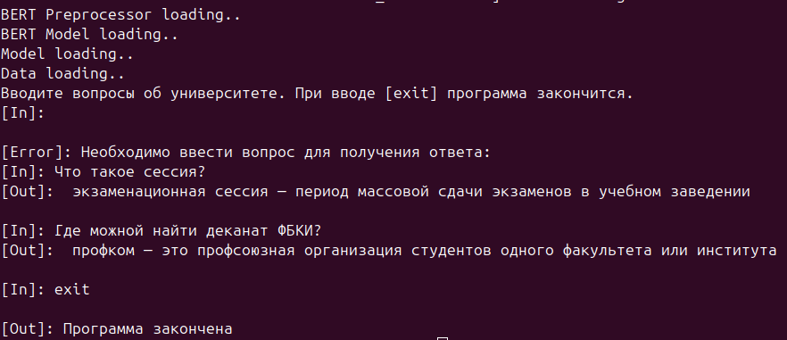

# FAQ чат-бот

## Формулировка задания

> Сделать FAQ чат-бот для работы без интернета на tensorflow.
> 
> Должен отвечать на вопросы из жизни университета/факультета/кафедры на русском языке.
> 
> Основная (backbone) сеть - любая небольшая языковая модель с поддержкой русского языка. Можно RuBERT.
> 
> Схема тренировки - Poly-encoder
> 
> Количество базовых пар вопрос-ответ - не менее 50.
> 
> Приложение должно состоять из двух программ - программа для тренировки и дистрибутив для установки на машине с питоном. Приложение должно работать (UI) либо через консоль, либо через библиотеку tkinter на ваш выбор.

## Описание

Реализация является консольным приложением. Код, использовавшийся для обучения модели, 
можно найти в [colab](https://colab.research.google.com/drive/1OTwm7qTy3261u85v-R5s_hMOz2w6-fKg?usp=sharing).

Установление зависимостей:

```bash
pip install -r requirements.txt
```

Сохранение языковой модели для локального использования:
```bash
python setup.py
```

Запуск бота:

```python
python main.py
```

## Демонстрация

